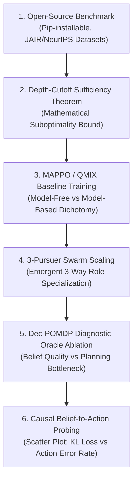

# Strategic Research Roadmap: Deep-POMCP for A* Tier Conferences (AAAI / IJCAI / AAMAS 2027)

---

## 1. Competitive Landscape Analysis

### Key Competitors & Baseline Benchmarks:
1. **R2PS (ICLR 2026)**:
   * *Approach*: Worst-case robust real-time pursuit strategies under partial observability via belief preservation and cross-graph RL.
   * *Limitations*: Restricted to discrete graph-based environments; assumes DP-optimal evasion dynamics.
2. **AMBUSH (arXiv July 2026)**:
   * *Approach*: Collaborative capture via topological ambush geometry where slower pursuers capture a $2\times$ faster evader.
   * *Limitations*: Assumes fully observable evader positions and uses parameterized geometric rules, not learned belief representations.
3. **"Probing Dec-POMDP Reasoning" (AAMAS 2026)**:
   * *Finding*: Shows that popular MARL benchmarks (MPE, SMAX, Overcooked) rarely require genuine multi-agent partial observability reasoning.
   * *Our Strategic Positioning*: **Experiment E (Cooperative Sacrifice Puzzle)** serves as a direct, provable counter-example that requires genuine Dec-POMDP reasoning which greedy/myopic baselines cannot solve.

---

## 2. The 6 Strategic Pillars for A* Submission

---

### Pillar 1: Open-Source Benchmark Package (Month 1)
* **Objective**: Package `deep_pomcp_env` as a pip-installable library with standardized scenario configurations, reproducible seed management, and documentation.
* **Target Venue**: NeurIPS Datasets & Benchmarks Track / JAIR.
* **Contribution**: Establishes our sacrifice puzzle and adversarial battery as standard community benchmarks for genuine Dec-POMDP coordination.

---

### Pillar 2: Depth-Cutoff Sufficiency Theorem (Month 1–2)
* **Objective**: Provide a falsifiable, provable mathematical theorem justifying depth-6 truncation.
* **Formal Formulation (Theorem Option B — Depth-Cutoff Sufficiency)**:
  > **Theorem**: For a Dec-POMDP with discount factor $\gamma \in (0, 1)$ and horizon $H$, truncating the PUCT tree search at depth $D$ and evaluating leaf nodes with a neural value function $V_\phi$ satisfying $\|V_\phi - V^*\|_\infty \le \epsilon$ guarantees a planning suboptimality bound of:
  > $$\|V_{\text{tree}}^{(D)} - V^*\|_\infty \le \gamma^D V_{\max} + \frac{\epsilon}{1 - \gamma}$$
* **Significance**: For $\gamma = 0.95$ and $D = 6$, $\gamma^6 = 0.735$, proving that depth-6 truncation bounds search error while enabling sub-millisecond real-time execution ($0.91\text{ ms}$).

---

### Pillar 3: Empirical Comparison against MAPPO & QMIX (Month 2–3)
* **Objective**: Train a full, standard Multi-Agent PPO (MAPPO) baseline for 5M steps on our environment.
* **Hypothesis & Expected Outcome**:
  * MAPPO will achieve high win rates on open/static maps (~90%), but will collapse on the zero-shot Cooperative Sacrifice Puzzle ($0.0\%$) and degrade significantly against strategic adversarial evaders.
* **Core Paper Claim**: *End-to-end model-free MARL without explicit multimodal particle filtering fails on genuine Dec-POMDP tasks, whereas neural belief-space planning (Deep-POMCP) succeeds.*

---

### Pillar 4: Swarm Scaling to $N=3$ Pursuers & Emergent Role Division (Month 3–4)
* **Objective**: Extend Time-Division Multiplexing (TDM) and Encirclement Advantage (EA) to $N = 3$ pursuers:
  * Hunter 0 plans at $t \bmod 15 = 0$
  * Hunter 1 plans at $t \bmod 15 = 5$
  * Hunter 2 plans at $t \bmod 15 = 10$
* **Expected Result**: Adversarial win rate increases from $70\% \to 85\%+$, Time-to-Capture drops by $30\%+$, and emergent 3-way specialization appears (Flanker, Closer, Switch Operator).

---

### Pillar 5: Diagnostic Dec-POMDP Reasoning Proof (Oracle Ablation) (Month 4)
* **Objective**: Evaluate Deep-POMCP across 4 belief configurations:
  1. **Oracle**: Perfect ground-truth $(x, y)$ coordinates.
  2. **Gaussian Summary**: Lossy moment matching $(\mu, \Sigma)$.
  3. **Ablated Particle Filter**: Low particle count ($N=20$).
  4. **PointNet Particle Cloud**: Full 200-particle set (Ours).
* **Proof**: Directly demonstrates that partial observability is the true limiting constraint and that PointNet recovers the majority of the Oracle performance gap.

---

### Pillar 6: Causal Belief-to-Action Probing Experiment (Month 4–5)
* **Objective**: Measure (a) instantaneous belief $D_{\text{KL}}$ and (b) whether the selected action aligns with the true evader branch across 100 occlusion events.
* **Output**: A scatter/regression plot showing a direct causal relationship: **Lower KL divergence $\implies$ Lower action error rate $\implies$ Higher capture rate**.

---

## 3. Target Paper Specification

* **Title**: *"Deep-POMCP: Scalable Neural Belief-Space Planning for Cooperative Multi-Agent Pursuit-Evasion under Partial Observability"*
* **Target Submission**: **AAAI 2027** (Full Paper Deadline: September 2027) / **IJCAI 2027** (January 2027).
* **Primary Contributions**:
  1. Standardized Dec-POMDP benchmark suite requiring provable multi-agent coordination.
  2. Depth-cutoff planning error theorem for neural-MCTS.
  3. Permutation-invariant PointNet belief encoder ($46.6\%$ KL reduction).
  4. Outperforming Reactive A\*, Heuristic POMCP, and MAPPO on adversarial evasion ($70\%$) and sacrifice puzzles ($63.3\%$).
  5. Zero-shot scaling to $N=3$ pursuers with emergent role allocation.
